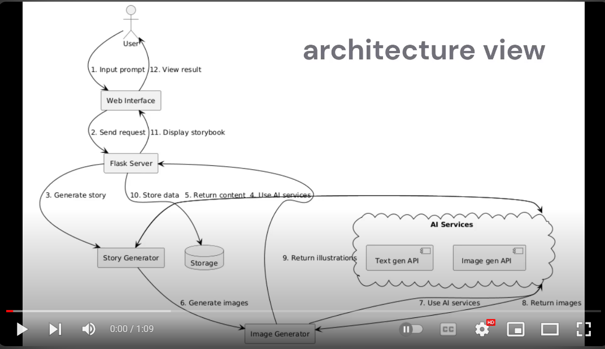

# AI Storybook Generator

## Introduction
AI Storybook Generator is an innovative web application that creates personalized children's stories complete with AI-generated illustrations. This tool combines the power of natural language processing and image generation to produce unique, engaging storybooks based on user prompts.

## Description
The application allows users to input a story prompt, which is then processed by AI models to generate a complete children's story. The story is automatically illustrated with AI-generated images, creating a full storybook experience. Users can view their generated stories online and explore previously created storybooks.

## For complete working code please connect with me @https://www.linkedin.com/in/harsh-joshi-ai-engineer/

## Technologies Used
- Python
- Flask (Web Framework)
- LLAMA3 API (for text generation)
- Stable Diffusion (for image generation)
- PIL (Python Imaging Library)
- JSON (for data storage)
- HTML/CSS (for frontend)

## Video Demo (as the deployment for a longer time costs a lot for a side project)

[](https://www.youtube.com/watch?v=JiLOqWepyo0w)


## Features
- User-friendly web interface for story prompt input
- AI-powered story generation
- Automatic illustration creation for each story segment
- Storybook viewing and navigation
- Caching system for improved performance
- Error handling and user feedback
- Rate limiting protection

## Get started
1) clone repo
2) run
   ```bash
   mkdir -p static/image && cp bg1.jpg bg2.jpg static/image/
   ```
4) run 
   ```bash
   mkdir -p templates && touch templates/index.html templates/upload.html
   ```
5) ```bash
   pip install -r requirements.txt
   ```
6) ```bash 
   flask run
   ```

## Future To-Do List
1. Add options for different story styles and age ranges
2. Introduce more customization options for character names and settings
3. Develop a PDF export feature for offline reading
4. Add support for multiple languages
5. Optimize image generation for faster processing
6. Introduce a simple editing tool for users to tweak generated stories
7.  Develop a mobile app version of the storybook generator

#### To get started
use python 3.10 or older
pip install -r requirements.tx
